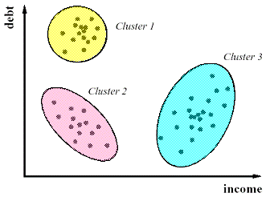
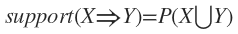
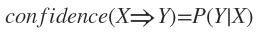

1.4 What Kinds of Patterns Can Be Mined?
******************************************
There are a number of **data mining functionality** . 

These include

* characterization and discrimination. 
* the mining of frequent patterns, associations, and correlations
* clutering analysis
* outlier analysis

In general, such tasks can be classified into two categories: **descriptive** and **predictive**.

1.4.1 Class/Concept Description: Characterization and Discrimination
-----------------------------------------------------------------------
Data characterization::
    a summarization of the general characteristics or features of a target class of data

1.4.2 Mining Frequent Patterns, Associations, and Correlations
-----------------------------------------------------------------------
frequent patterns::
    As the name suggests, are patterns that occur frequently in data.

There are many kinds of frequent patterns, including

* frequent itemsets
* frequent subsequences(also known as sequential patterns)
* frequent substructures

frequent itemsets::

    a set of items that often appear together in a transactional data set

    for example, milk and bread, which are frequently bought together in grocery stores by many customer.

frequent subsequences::

    A frequently occurring subsequences such as the pattern that customers, 
    tend to purchase first a laptop, followed by a digital camera, 
    and then a memory card.

frequent substructures::

    A substructure can refer to different structural forms
    (e.g., graphs, trees, or lattices) that may be combined with itemsets 
    or subsequences.

    If a substructure occurs frequently, it is called a frequent structured pattern.

Mining frequent patterns leads to the discovery of interesting associations and correlations within data.

1.4.3 Classification and Regression for Predictive Analysis
---------------------------------------------------------------
classification::
    
    the precess of finding a model (or function) that describes and 
    distinguishes data classes or concepts.
    
    The model are derived based on the analysis of a set of training 
    data(i.e, data objects for which the class labels are known). 

    The model is used to predict the class label of objects for which 
    the class label is unknown

1.4.4 Cluster Analysis
---------------------------

cluster analysis vs classification and regression
~~~~~~~~~~~~~~~~~~~~~~~~~~~~~~~~~~~~~~~~~~~~~~~~~~~~
Unlike classfication and regression, which analyze class-labeled (training) data sets, **clustering** analyze data objects without consulting class labels.

Clustering can be used to generate class labels for a group of data.

1.4.5 Outlier Analysis
------------------------
Outliers::
    
    a data set may contain objects taht do not comply the general behavior or 
    model of the data.  These data objects are outliers.

Many data mining methods discard

Exaple
~~~~~~~~
Outlier analysis may uncover fraudulent usage of credit cards by detecting purchases of unusually large amounts for a given account number in comparison to regular charges incurred by the same account.

1.4.6 Are All Patterns Interesting?
----------------------------------------
only a small fraction of the patterns potentially generated would actually be of interest to a given user.

a patten is interesting if it is

1. easily understood by humans
2. valid on new or test data with some degree of certainty
3. potentially useful
4. novel
5. validates a hypothesis that the user sought to confirm.

support::
    
    the percentage of transactions from a transaction database that the given rule satisfies.

confidence::
    
    assesses the degree of certainty of the detected association.

