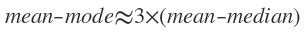

2.2 Basic Statistical Descriptions of Data
**********************************************
2.2.1 Measuring the Central Tendency: Mean, Median, and Mode
-----------------------------------------------------------------
*to offset the effect caused by a small number of extreme values, we can instead use the* **trimmed mean**.

trimmed mean::
    
    the mean obtained after chopping off values at the high and low extremes.
    For example, we can sort the values observed for salary and remove the top
    and bottom 2% before computing the mean.

For unimodal numeric data that are moderately skewed, we have the following empirical relation:

This implies that the **mode** for unimodal frequency curves that are moderately skewed can easily be approximated if the *mean* and *median* values are known.

2.2.2 Measuring the Dispersion of Data:Range, Quartiles, Variance, Standard Deviation, and Interquartile Range
-------------------------------------------------------------------------------------------------------------------
Range, Quartiles, and Interquartile Range
~~~~~~~~~~~~~~~~~~~~~~~~~~~~~~~~~~~~~~~~~~~~~~~~~~~
range::
    
    the difference between the largest and smallest values.

quantiles::
    
    points taken at regular intervals of a data distribution, dividing it into essentially equalsize consecutive sets.

quantiles::
    
    the 4-quantiles are the three data points that split the data distribution 
    into four equal parts; 
    each part reprents one-fourth of the data distribution.

percentiles::
    
    100 quantiles

interquartile range(IRQ)::
    
    the distance between the first and third quartiles is a simple measure of
    spread that gives the range covered by the middle half of the data.

Five-Number Summary, Boxplots, and Outliers
~~~~~~~~~~~~~~~~~~~~~~~~~~~~~~~~~~~~~~~~~~~~~~~
five-number summary::
    
    the median, the quartiles Q1 and Q3, and the smallest and largest individual observations.
    written in the order of Minimum, Q1, Median, Q3, Maximum

